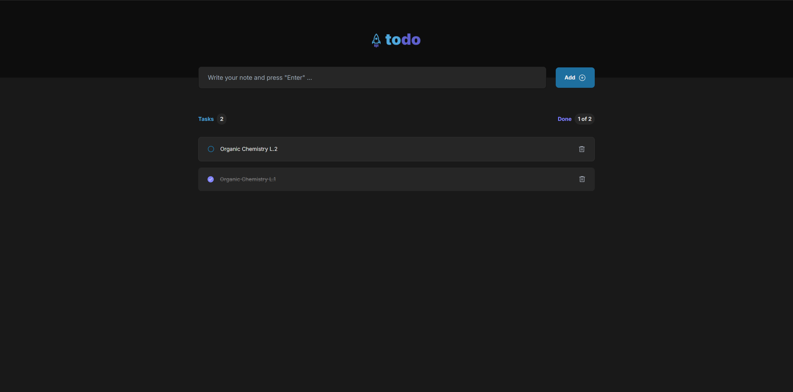

# Todo-React

This application is a To-Do list manager built with React. It offers a clean and interactive user interface with smooth animations, allowing users to efficiently manage their tasks and to-do items. 



## Features

- **Intuitive UI:** Provides a user-friendly interface with smooth animations and transitions for a pleasant experience.
- **Task Management:** Allows users to add, delete, and mark tasks as done effortlessly.
- **Responsive Design:** Ensures that the application is fully responsive and accessible on various devices and screen sizes.
- **Interactive Elements:** Features animations for interactions like adding, completing, and removing tasks.

## Technologies Used

- **React:** JavaScript library for building user interfaces.
- **Vite:** Fast build tool and development server.
- **Tailwind CSS:** Utility-first CSS framework for styling.
- **React Icons:** Provides a set of popular icons used in the UI.
- **ESLint:** Tool for identifying and fixing problems in JavaScript code.

## Installation

To run this project locally, follow these steps:

1. **Clone the Repository:**
   ```bash
   git clone https://github.com/ahmedkamal14/Todo-React.git
   cd Todo-React
   
2. **Install Dependencies:**
   ```bash
    npm install

3. **Run the Development Server:**
   ```bash
    npm run dev

  ## Deployment

  -This project is deployed on GitHub Pages. You can view the live site at: [Todo App](https://ahmedkamal14.github.io/Todo-React/).
